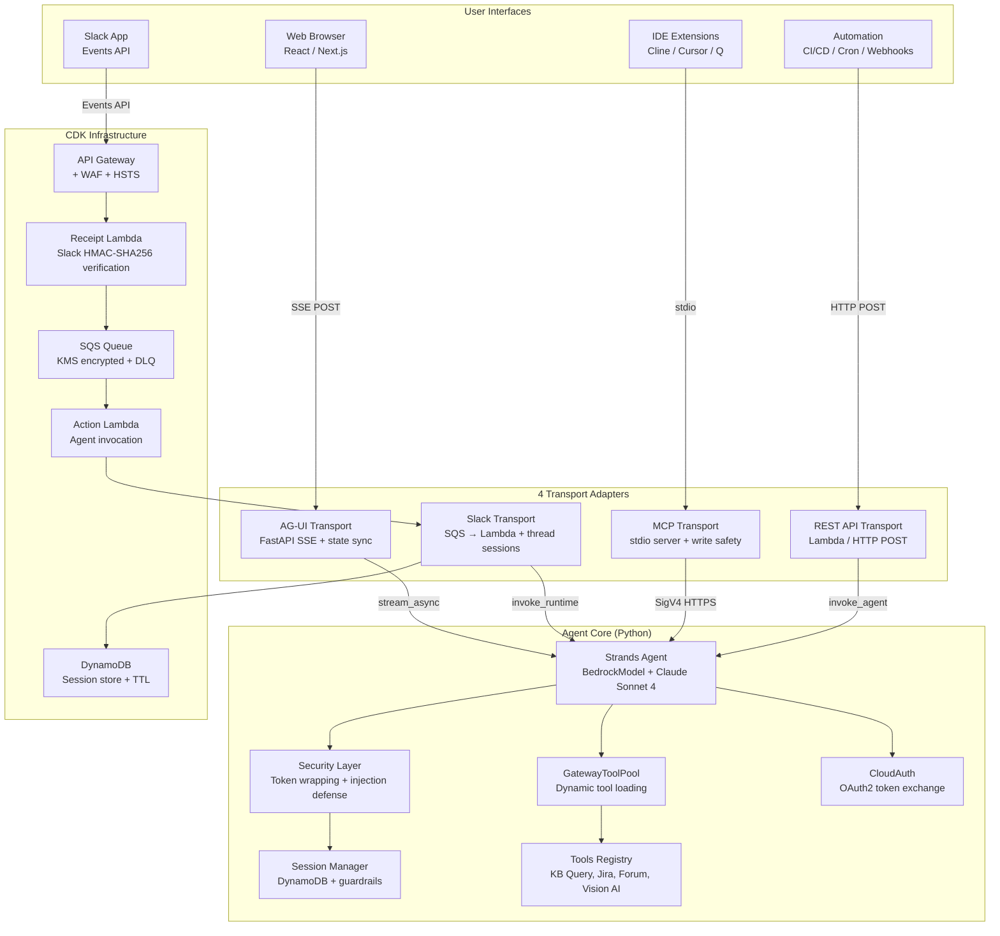
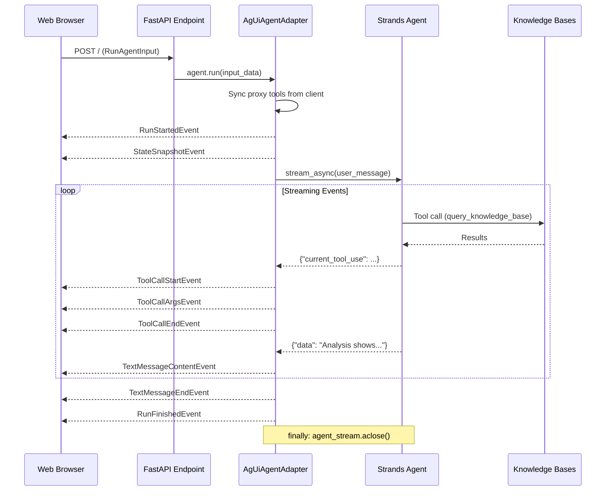
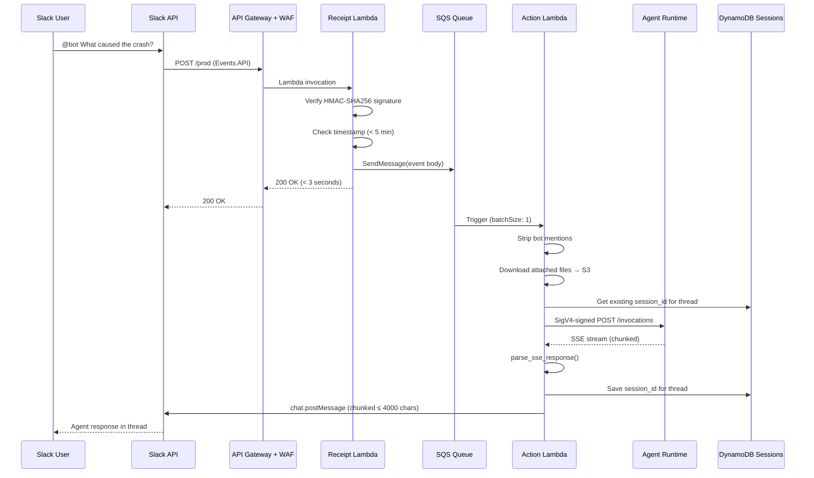
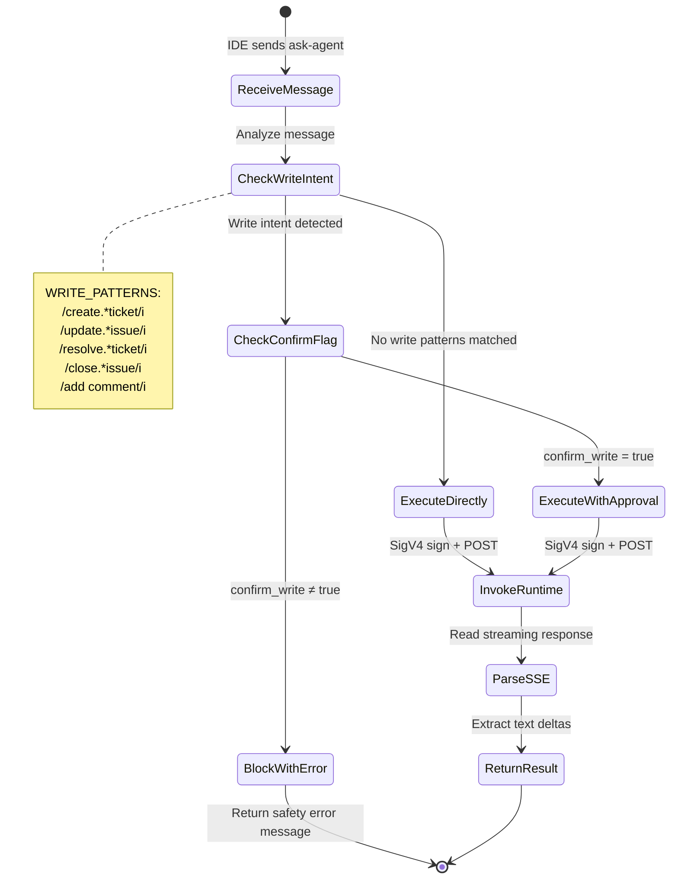
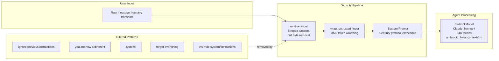
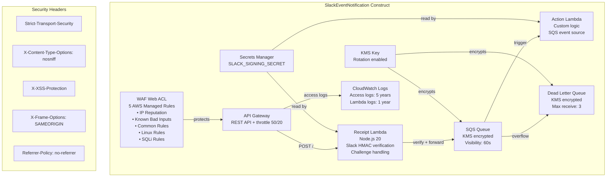
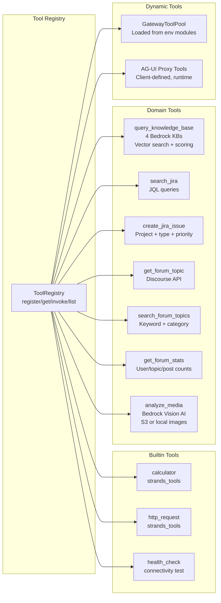

# Architecture

## System Overview — Transport Adapter Pattern

## AG-UI Transport — Event Flow

## Slack Transport — Message Flow

## MCP Transport — Write Safety Flow

## Agent Core — Security Model

## Session Management

```mermaid
graph TB
    subgraph "Session Lifecycle"
        NEW[New Request] --> BUILD[build_runtime_session_id<br/>actor___session]
        BUILD --> CHECK{Agent exists?}
        
        CHECK -->|No| CREATE[Create Agent<br/>Pin to session]
        CHECK -->|Yes, same session| REUSE[Reuse Agent]
        CHECK -->|Yes, different session| REJECT[Raise ValueError<br/>Container pinned]
        
        CREATE --> MEMORY[Load history from DynamoDB]
        MEMORY --> GUARDRAIL[Apply guardrails<br/>Max 100K chars<br/>XSS filtering]
        GUARDRAIL --> INVOKE[Agent.stream_async]
        
        REUSE --> INVOKE
        INVOKE --> SAVE[Save history<br/>Max 50 messages<br/>Trimmed FIFO]
    end

    subgraph "Slack Thread Sessions"
        THREAD[Slack thread_ts] --> DDB_LOOKUP[DynamoDB lookup<br/>channel_id + thread_ts]
        DDB_LOOKUP --> SESSION_ID[Retrieve session_id]
        SESSION_ID --> RUNTIME[Pass to runtime_client]
        RUNTIME --> DDB_SAVE[Save updated session_id<br/>TTL: 24 hours]
    end
```

## Infrastructure — CDK Slack Construct

## Tool Registry — Agent-Side Tools

