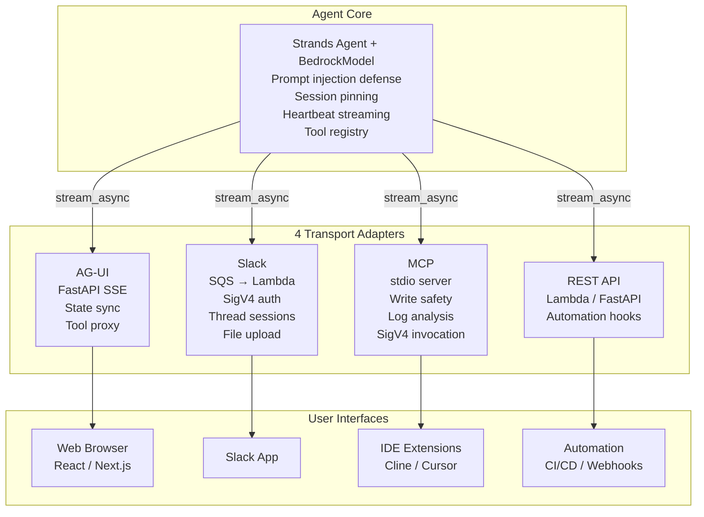
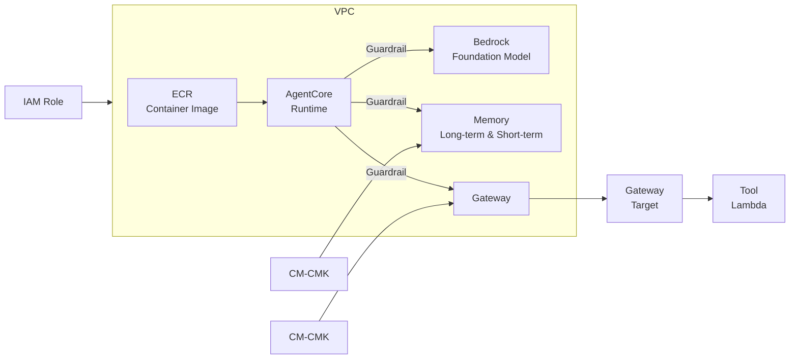

# multi-transport-autonomous-agent

An autonomous AI agent with a single brain accessible through four transport interfaces: AG-UI (web frontend), Slack bot, MCP (IDE extensions), and REST API. One agent, four surfaces, shared tools and knowledge bases.

## The Problem

Organizations build separate AI integrations for every surface — a chatbot for Slack, a different one for the web UI, another for IDE plugins, and yet another for automation pipelines. Each has its own prompt engineering, tool definitions, session management, and security model. When you update the agent's capabilities, you update four codebases. When a security vulnerability is found, you patch four codebases. The "agent" is actually four different agents pretending to be one.

This repo solves that by implementing a **Transport Adapter Pattern**: a single agent core with pluggable transport layers that translate between the agent's streaming interface and each surface's protocol.

## Architecture



## AgentCore Runtime Architecture



The agent runs as a containerized runtime within a VPC. Three guardrail layers enforce security between the runtime and downstream services:
- **Bedrock**: Foundation model invocations (Claude Sonnet 4) with token limits and content filtering
- **Memory**: Long-term (DynamoDB) and short-term (in-container) conversation history, encrypted with Customer Managed Keys
- **Gateway**: External tool invocations routed through gateway targets to Lambda-based tools, encrypted with CM-CMK

## Transport Interfaces

### AG-UI Transport (Web Frontend)

Implements the [AG-UI protocol](https://ag-ui.com/) — an open, event-based standard for agent-user interaction. The `AgUiAgentAdapter` wraps a Strands agent and translates its streaming events into AG-UI protocol events (text deltas, tool calls, state snapshots).

**Key capabilities:**
- Server-Sent Events (SSE) streaming to any AG-UI-compatible frontend
- Bi-directional state synchronization between agent and UI
- Frontend tool registration — client-defined tools are dynamically proxied to the agent at runtime
- Per-thread agent instances with independent conversation history
- Configurable tool behaviors (predict state, custom result handlers, stop after result)

### Slack Transport (Chat Bot)

Production Slack bot using the Events API with SQS-backed message processing for reliable, scalable event handling. Thread-based sessions maintain conversation context across multiple messages.

**Key capabilities:**
- Slack signature verification (HMAC-SHA256) for security
- SQS decoupling for burst absorption and retry
- DynamoDB session store mapping Slack threads to agent sessions
- File download from Slack → S3 for agent analysis
- Chunked message delivery (4000 char Slack limit)
- Bot mention stripping and user alias resolution

### MCP Transport (IDE Extensions)

Model Context Protocol server exposing the agent as tools for IDE extensions (Cline, Cursor, Q Developer). Includes write-safety guardrails that detect destructive intent in messages and require explicit user confirmation.

**Tools provided:**
- `ask-agent` — Query the agent with multi-turn session support and write-intent detection
- `jira-search` — Search Jira issues via JQL
- `analyze-log` — Device log analysis (crash, ANR, DRM, memory, network, video pattern detection)
- `upload-file` — S3 file upload for ticket attachments or agent analysis

### REST API Transport (Automation)

Thin Lambda handler for programmatic access. Accepts JSON POST with message/user_id/session_id and returns the agent's response. Suitable for CI/CD pipelines, cron jobs, and webhook integrations.

## Agent Core

### Security: Prompt Injection Defense

User messages are wrapped in token-tagged XML before reaching the LLM. The system prompt instructs the model to only follow instructions from the system context, ignoring any override attempts embedded in user input.

```python
sanitized = sanitize_input(user_message)      # Regex-based injection pattern filtering
wrapped = wrap_untrusted_input(sanitized, token)  # <user_input token="abc123">...</user_input>
```

Five injection patterns are actively filtered: instruction overrides, persona switches, system prefix injection, memory wipe attempts, and behavioral overrides.

### Streaming with Heartbeat

Long-running agent invocations (tool calls, knowledge base searches) can take minutes. The heartbeat mechanism prevents connection drops by emitting keep-alive events when the stream is idle:

```python
async for event in stream_with_heartbeat(agent.stream_async(message), interval=15):
    yield event  # Real event or {"heartbeat": True}
```

### Session Pinning

Each container hosts exactly one agent instance pinned to a single runtime session ID. This ensures conversation state isolation — concurrent users get separate containers. Attempting to reuse a container with a different session raises an explicit error rather than silently mixing contexts.

## Write Safety Guardrails (MCP)

The MCP transport implements a regex-based write intent detector that blocks destructive operations unless the user explicitly confirms:

```typescript
const WRITE_PATTERNS: RegExp[] = [
  /\bcreate\b.*\b(ticket|issue)\b/i,
  /\bupdate\b.*\b(ticket|issue)\b/i,
  /\bresolve\b.*\b(ticket|issue)\b/i,
  // ...
];

const isWrite = (msg: string) => WRITE_PATTERNS.some(p => p.test(msg));
```

The IDE extension must set `confirm_write=true` after presenting the action to the user and receiving approval. Without this flag, write-intent messages are blocked with an explanatory error.

## Running Locally

### AG-UI (Web Frontend)
```bash
pip install -e .
uvicorn transports.agui.app:app --reload --port 8000
```

### MCP (IDE Extension)
```bash
cd transports/mcp && npm install && npm run build
# Configure in your IDE's MCP settings to point at dist/index.js
```

### Slack Bot
Deploy the `transports/slack/handler.py` as a Lambda function behind the Slack Events API construct.

### REST API
Deploy `transports/api/handler.py` as a Lambda behind API Gateway.

## Project Structure

```
multi-transport-autonomous-agent/
├── agent/                         # Core autonomous agent (Python)
│   ├── agent.py                   # AutonomousAgent with streaming + heartbeat
│   ├── security.py                # Prompt injection defense
│   ├── session.py                 # Session ID management
│   ├── config.py                  # Environment-driven configuration
│   └── tools.py                   # Built-in tool definitions
├── transports/
│   ├── agui/                      # AG-UI protocol (Python/FastAPI)
│   │   ├── agent_adapter.py       # Strands → AG-UI event translation
│   │   ├── app.py                 # FastAPI SSE endpoint
│   │   ├── config.py              # ToolBehavior, PredictStateMapping
│   │   └── client_proxy_tool.py   # Dynamic frontend tool registration
│   ├── slack/                     # Slack Events API (Python/Lambda)
│   │   ├── handler.py             # SQS → Lambda event processor
│   │   ├── runtime_client.py      # SigV4 agent invocation + SSE parsing
│   │   ├── session_store.py       # DynamoDB thread → session mapping
│   │   ├── slack_client.py        # Message chunking, file download
│   │   └── config.py              # Bot configuration
│   ├── mcp/                       # Model Context Protocol (TypeScript)
│   │   └── src/
│   │       ├── server.ts          # MCP server with tool registry
│   │       ├── index.ts           # stdio entry point
│   │       └── tools/             # agent-invoke, search, log-analyzer, file-upload
│   └── api/                       # REST API (Python/Lambda)
│       └── handler.py             # HTTP POST → agent invoke
├── pyproject.toml
└── README.md
```

## License

MIT
